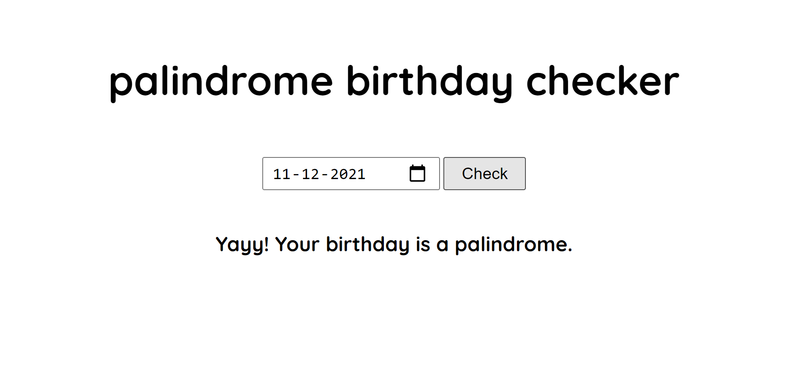

# Palindrome Birthday Checker

An app that checks if your birthdate is a palindrome or not.

## Overview

### Screenshot



### Links

- Live Site URL: [https://palindrome-birthday-darshan.netlify.app/](https://palindrome-birthday-darshan.netlify.app/)

## My process

### Built with

- HTML
- CSS
- JavaScript

### What I learned

How easy it is to check for a palindrome.

```js
const isPalindrome = (str) => {
  return str === str.split("").reverse().join("");
};
```

## Author

- Twitter - [@DarshanDamre](https://twitter.com/DarshanDamre)
- LinkedIn - [Darshan Damre](https://www.linkedin.com/in/darshandamre/)
- Website - [Darshan Damre](https://darshandamre.netlify.app/)
